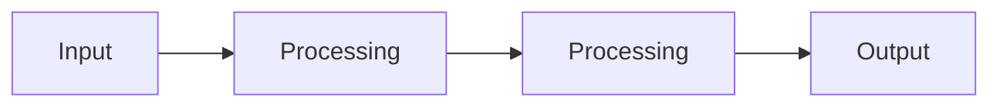

# 2025-12-11 : Premier cours

## Architecture monolythique

Une architecture monolythique est une architecture dans laquelle tout le code est compilé en un seul executable.  
Ce qui veut dire que ce seul executable contient toutes les fonctionnalités et exigences du CDC de l'application.

- Architecture la plus simple théorique mais paradoxalement **la plus complexe à concevoir** et analyser.
- La vue monolithique **empeche la réutilisation**.
- **Très performante** et très **peu scalable**.

## Architecture Pipeline

Consiste à faire passer les informations en cascade.  
Chaque étape est une fonctionnalité de l'application.  
Exemple : les node graph dans UE5 ou Blender.

- Facile à comprendre et à analyser.
- Facile à développer et à maintenir.
- Réutilisable.

Exemple de pipeline :

## Architecture MVC

Elle est composée de 3 parties :

- Model
  - Représente les données de l'application et leur logique interne.
- View
  - Représente et interagis avec le modèle directement (lecture) ou au travers du contrôleur (écriture) pour traiter les actions des utilisateurs.
- Controller
  - Sert d'intermédiaire entre la vue et le modèle pour traiter les actions des utilisateurs et leurs impacts sur les données.

**Attention** :  
Il ne faut pas confondre les architectures MVC avec les architectures sur 3 niveaux (3-tiers).  
Dans ce dernier les composants ne communiquent qu'avec les composants d'un niveau inférieur ou supérieur.  
En MVC, la vue peut directement interagir avec le modèle pour les opérations de lecture. Ainsi, le contrôleur peut être contourné pour des opérations n'impactant pas la cohérence du modèle.

## Architecture multi-couches

Ce sont des architectures qui permettent de réunir des fonctionnalités par couches d'abstraction.

## Architecture N-tiers

C'est un style similaire à l'architecture multi-couches.  
La diférence viendra principalement des utilisations faites de l'architecture. En général les architectures n-tiers sont utilisés pour des systèmes distribués.

## Architecture orienté services (SOA)

Ce style d'architecture et la conséquence logique de l'évolution des architectures n-tiers.  
Il vise à faciliter l'intégration de composants distribués en forçant une vision service et consommation entre les différents composants.  
Ces derniers sont pensés sous la forme d'éléments interconnectés en réseau avec un "couplage faible".  
C'est-à-dire que 2 services couvrant les mêmes besoins peuvent être interchangés si leurs interfaces (ou protocoles) sont suffisamment standardisées.

Les composants peuvent prendre différents rôles :

- fournisseur de services (Provider)
- enregistreur de services (Broker)
- consommateur de services (Consumer)

Exemple :  
Amazon est un enregistreur de services (Broker) qui met en lien des fournisseurs de services (Provider) et des consommateurs de services (Consumer).

## Architecture Microservices

Le style d'architecture micro-services va permettre D'adapter le nombre d'instances nécessaires pour le traitement d'informations en fonction des demandes.  
C'est une architecture massivement distribuée qui fait souvent usage des infrastructures cloud et propose une mise à l'échelle en continu des moyens mis à disposition des utilisateurs.
