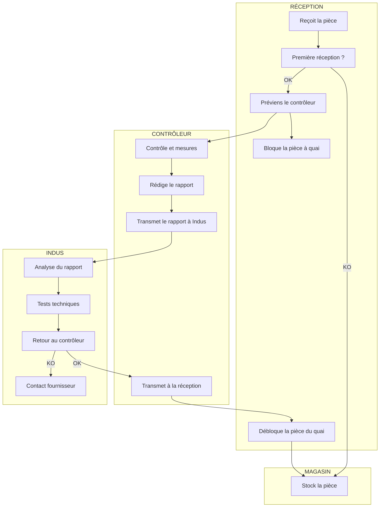
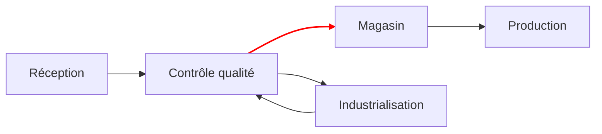
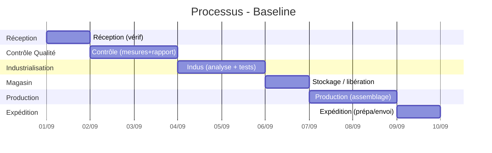
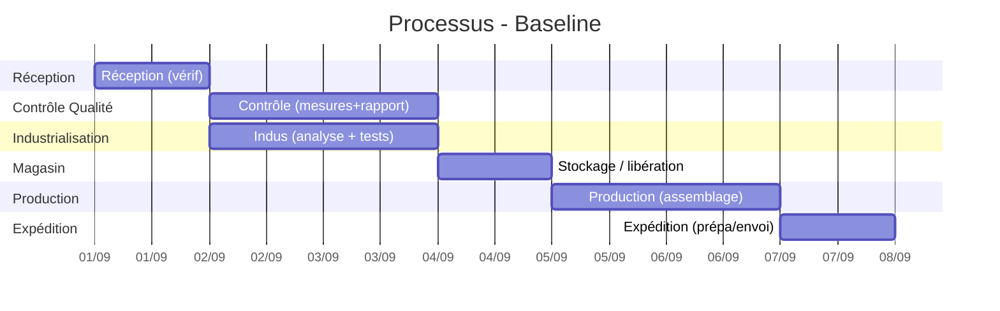

Contexte :  
Dans une entreprise fictive de production industrielle, je travaille au contrôle qualité de la réception des pièces de l'assemblage.  
Lorsce qu'on recoit une pièce destinée à la production pour la première fois, il faut effectuer un contrôle complet et détaillé et rendre un rapport au service du industrialisation (indus).  
Pendant le temps du contrôle, la pièce est bloquée à quai et ne peux pas aller en production.

# Exercice 1A

### Qualité externe :

1. Si une pièce pour la production est de mauvaise qualité et est tout de même assemblée et vendue, des clients peuvent avoir une mauvaise expérience.

### Qualité interne :

1. Le protocole mis en place est cohérent, des pièces qui n'ont jamais étés assemblées avant doivent passer par un contrôle poussé en premier lieu.

# Exercice 1B

Le processus de contrôle des pièces réceptionnées pour la première fois est :

- Le service réception recoit la pièce, constate que c'est la première réception et préviens le contrôleur et bloque la pièce à quai.
- Le contrôleur contrôle, mesure et note tout dans un rapport selon les plans de la pièce.
- Le contrôleur donne le rapport à l'Indus.
- L'indus consulte le rapport & effectue ses tests.
- L'indus conclut : OK ou KO.
- SI OK
  - Débloque les pièces du quai de réception et communique avec le magasin
- SI KO
  - L'indus prend contact avec le fournisseur. Le fournisseur renvoie une nouvelle version
  - Le contrôleur renvoie les pièces au fournisseur.

# Exercice 1C

### SwimLane

---

# Exercice 1D

1. Les intérets que je vous à définir des processus sont :

   - Un gain de temps sur la communication. En standardisant les informmations échangées, on assure leurs bonne compréhension.
   - Le fait d'être concis dans ces échanges donne un gain d'efficacité, qui permet de mieux visualiser l'avancement des choses.

2. Il peut être complexe de mêtre en place de bon processus solides pour diverses raisons :

   - La répartition des tâches est parfois dificile à mètre en place.
   - Les changements d'habitue de travail peuvent ralentir la transition.
   - Le coût des changement peut ralentir voir empecher la transition.

3. Si il y a des difficultés à mettre en place des processus, selon moi la première chose à faire et d'effectuer un audit sur les méthodes de travail et la gestion des flux, par une société spécialisée.  
   Un point de vie extérieur et d'autant plus profesionnel sur la question est un atout important pour établir une stratégie.

# Exercice 1E

Le service de contrôle qualité peut devenir un goulot d'étranglement pour plusieurs raisons :

- Si la réception réceptionne une grosse livraison d'un coup, le nombre de contrôles à effectuer peut engendrer une file d'attente.
- Si le service industrialisation met du temps à rendre son verdict sur les nouvelles pièces, elles restent bloqués.

Ces ralentissement, voir bloquages, se répercutent sur la production, et in fine aux délais d'expéditions.

# Exercice 2

| Poste                 | Description                                   | Temps moyen | Capacité (tâches/jour) | Expertise (1-3) |
| --------------------- | --------------------------------------------- | ----------- | ---------------------- | --------------- |
| Réception             | Réception livraison, identification 1ère fois | 0.25j (2h)  | 40                     | 1               |
| Contrôle Qualité      | Mesures + contrôle + rapport                  | 1j (6–8h)   | 8                      | 3               |
| Industrialisation     | Analyse rapport, tests techniques, décision   | 1j (8h)     | 5                      | 3               |
| Magasin (quarantaine) | Stockage / libération après validation        | 0.125j (1h) | 50                     | 1               |
| Production            | Assemblage / transformation en produit fini   | 2j (16h)    | 3 lots/j               | 2               |
| Expédition            | Prépa envoi / livraison                       | 0.5j (4h)   | 20                     | 2               |

---

### **Étape 2 : Enchaînement entre postes**

- Flux séquentiel : Réception → Contrôle (Mesures+Rapport) → Indus → Magasin (quarantaine) → Production → Expédition
- Attentes (exemples) :

  - Réception → Contrôle : 0.25j
  - Contrôle → Indus : 0.5–1j (selon backlog)
  - Indus → Magasin : 1j
  - Production → Expédition : 2j → 0.5j

---

### **Étape 3 : Contraintes**

- Durée totale cible ≤ **5j**.
- Goulots :

  - **Contrôle** (2 experts max) — pic de nouvelles références.
  - **Industrialisation** (1 expert) — décision critique.

- Ressources limitées (temps expert, espace quai).

---

### **Étape 4 : Solutions d’optimisation (math/orga)**

- **Paralléliser** : séparer Contrôle en _Mesures_ + _Rédaction_ ; Indus peut démarrer tests sur _Mesures_ -> superposition.
- **Dupliquer partiellement** : 1 technicien support Indus (ou form. second contrôleur) pour absorber pics.
- **Tampon magasin (quarantaine)** : stockage contrôlé pour libérer quai.
- **Digitaliser suivi** : ticket automatique -> moins d’attente de communication.

---

### **Étape 5 : Solutions réalistes retenues**

- Mettre en place **quarantaine magasin** (rapide, peu coûteux).
- Former un technicien pour délester l’Indus (coût raisonnable).
- Lancer un **outil de workflow simple** (ticket + notifications) — gain immédiat.

### 2) Gantt avec les solutions

# Exercice 3A

- **Complexification progressive** :

  - Ajout de nombreux acteurs (Réception, Contrôle, Indus, Magasin, Production, Expédition).
  - Multiplication des validations avant mise en stock.

- **Processus devenus moins efficaces** :

  - Pièces bloquées à quai → attente longue si backlog CQ ou Indus.
  - Communication parfois lente → retards en production et expédition.

- **Politique d’amélioration continue** :

  - Améliorations plutôt **au fil de l’eau** (quarantaine magasin, optimisation communication).
  - Quelques **projets ciblés** possibles (digitalisation workflow, formation technicien Indus).

# Exercice 3B

- **Lean (éliminer gaspillages)** : **50 %**

  - Réduire attentes (CQ/Indus), limiter blocage à quai, fluidifier flux.

- **Six Sigma (standardiser)** : **30 %**

  - Formaliser rapports, procédures, communication → éviter erreurs/retards.

- **Innover (repenser)** : **20 %**

  - Outils numériques (workflow, suivi automatisé), magasin quarantaine.

# Exercice 3C

- **S (Substitute)** : remplacer validation papier par workflow numérique.
- **C (Combine)** : combiner mesures CQ + pré-tests Indus.
- **A (Adapt)** : adapter le processus avec un magasin “quarantaine”.
- **M (Modify)** : modifier le rapport CQ → plus visuel, standardisé.
- **P (Put to other uses)** : utiliser données CQ pour former opérateurs prod.
- **E (Eliminate)** : supprimer double saisie (CQ → Indus).
- **R (Reverse)** : lancer prod pilote avant validation finale Indus (petite série test).

# Exercice 3D

### **Design Thinking – 7 étapes**

1. **Empathie** : écouter réception, CQ, Indus, magasin, production.
2. **Définir** : problème = pièces bloquées à quai, délais CQ/Indus.
3. **Idéation** : atelier groupe mixte (CQ, Indus, prod, magasin).
4. **Prototype** : maquette workflow numérique / magasin quarantaine.
5. **Test** : simuler sur un lot pilote.
6. **Implémenter** : déployer si gains mesurés.
7. **Évaluer** : recueillir feedback et ajuster.

---

### **Organisation**

- **Groupe** : réception, CQ, Indus, prod, magasin, 1 représentant client interne.
- **Animateur** : responsable qualité ou facilitateur externe.
- **Participation** : post-its, brainstorming rapide, règles simples (pas de jugement).
- **Visualisation** : tableau Kanban / mur d’idées, schémas Mermaid.
- **Simulation** : test sur un flux réel (petite série de pièces).

# Exercice 3E

1. **Définition des personas**

   - Réceptionniste, Contrôleur qualité, Ingénieur Indus, Magasinier, Client final.

2. **Recherche de données**

   - Interviews internes (CQ, Indus), observation flux réception/production, retours clients.

3. **Création des personas**

   - Fiches simples : rôle, besoins, frustrations (ex. : Contrôleur → manque de temps, Indus → surcharge).

4. **Analyse de la situation**

   - Identifier blocages : attente longue à quai, goulot Indus, communication lente.

5. **Conception du processus**

   - Chaque persona propose : réception veut simplification, CQ veut outils, Indus veut support, client veut délais fiables.

6. **Validation**

   - Tester nouveau processus (workflow + magasin quarantaine) avec l’équipe + pilote sur un lot réel.
