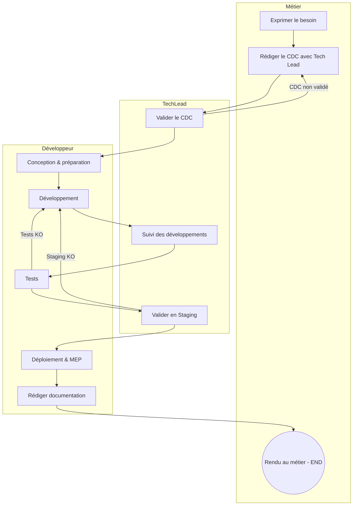
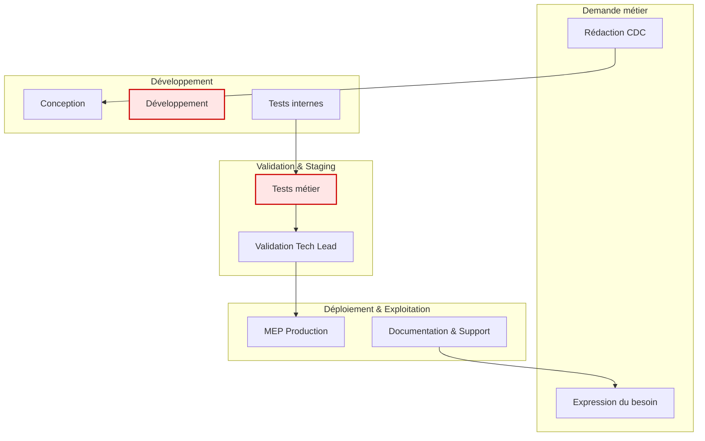
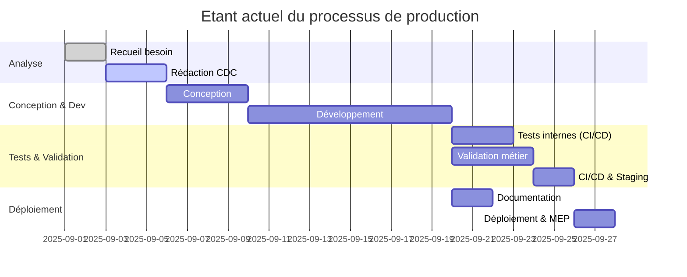
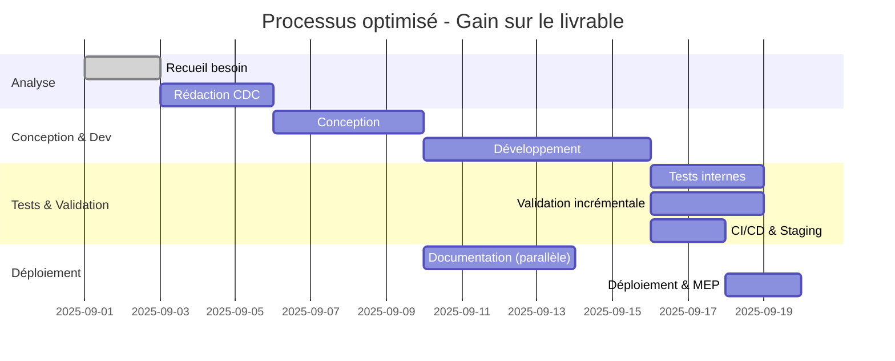

# Exercice 1A

### Consigne :

1. Trouver un exemple de qualité externe
2. Un exemple de qualité interne

### Solution :

Contexte : Je fait des small-apps pour des services métiers de l'entreprise.  
Imaginons que un service métier me demande une small-app pour traiter des dossiers administratifs Excel.  
Actuellement ils traitent les informations à la main.

1. En qualité externe de leur demande :  
   L'application permet de faire le même traitement qu'ils effectuaient avant, en gagnant du temps.  
   Elle permets même la récupération d'anciennes fiches excels pour rétro-compatibilité.  
   Tech lead s'assure que le CDC est respecté, réunions toutes les 1 ou 2 semaines avec le métier pour checkup.

2. En qualité interne :  
   Le traitement des données ext ISO9001 & ISO20000  
   Respect des rêgles internes de l'entreprise sur le traitement des données.  
   Respect des normes de l'entreprise quant à la DB utilisée.  
   Respect des RGPD vis à vis des données traités depuis les Excels.

# Exercice 1B

### Consigne :

1. Définir le processus globale

### Solution :

1. Le métier demande une update de la small-app pour rajouter du traitement sur les données.  
   **Les acteurs** : Un représentant du métier, le techlead et moi développeur.  
   **Les données** : Celles traités par l'application lors de la complétion d'un formulaire administratif sur l'application.  
   **Les indicateurs** : Suivi de l'avancement du développement sur gitlab via tickets + planning.  
   **Les étapes** :
   - Définition du besoin, rédaction d'un CDC.
   - Conception, préparation et définition des étapes.
   - phase de développement avec suivi de l'avancement par le tech lead.
   - Tests et passage en Staging.
   - Déploiement, MEP.
   - Rédaction / documentation des modifications ajoutés.

# Exercice 1C

### Consigne :

1. Définir le processus soit sous format SIPOC, SwimLane, BPMN

### Solution :

**SwimLane :**

# Exercice 1E

### Consigne :

1.  Faire une petite carte macro de plusieurs processus entre eux

### Solution :

# Exerceice 2 et 2 suite

### **Étape 1 : Description de l’existant (par poste)**

| Poste                | Description                                             | Temps moyen | Capacité (tâches/jour) | Expertise (1-3) |
| -------------------- | ------------------------------------------------------- | ----------- | ---------------------- | --------------- |
| 1. Recueil besoin    | Le métier exprime le besoin, réunions avec le tech lead | 2 j         | 1 demande              | 2               |
| 2. Rédaction CDC     | Formalisation cahier des charges (tech lead + métier)   | 3 j         | 1 CDC                  | 3               |
| 3. Conception        | Analyse technique et architecture par le développeur    | 4 j         | 1 design               | 3               |
| 4. Développement     | Codage des fonctionnalités                              | 10 j        | 5 features/jour        | 3               |
| 5. Tests internes    | Tests unitaires & intégration                           | 3 j         | 10 cas test/jour       | 2               |
| 6. Validation métier | Recette fonctionnelle                                   | 4 j         | 5 cas test/jour        | 2               |
| 7. Déploiement       | Mise en prod & documentation                            | 2 j         | 1 déploiement          | 2               |
| 8. CI/CD & Staging   | Pipelines de build MES                                  | 2j          | 1 déploiement          | 2               |

---

---

### **Étape 2 : Enchaînement entre postes**

- Flux séquentiel : Besoin → CDC → Conception → Dev → Tests → Validation → MEP
- Attentes :
  - besoin --> CDC : 2j
  - dev --> tests : 1j
  - Validation --> MEP : 2j

---

### **Étape 3 : Contraintes**

- Durée totale < 30j.
- Goulots :
  - Dev (1 dev pour 10j de taff)
  - Validation (besoin de la dispo du métier)

---

### **Étape 4 : Solutions d’optimisation**

- Documentation : Commence dès le début du dev en parallèle.
- CI/CD peut être paralléliser en même temps que le déclenchement de la validation.
- 2eme développeur --> Temps de dev 10j --> 6j

---

### **Étape 5 : Solutions réalistes retenues**

- CI/CD deja prêt à l'emploi
- RH : Recruter un dev

---

### Diagramme Gantt

