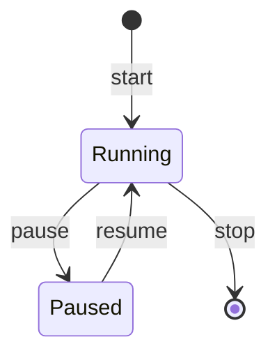
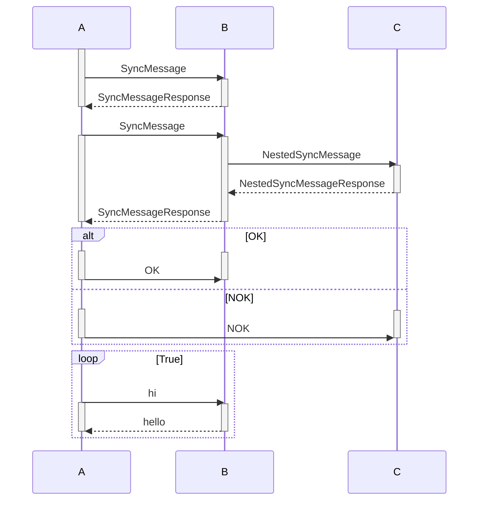
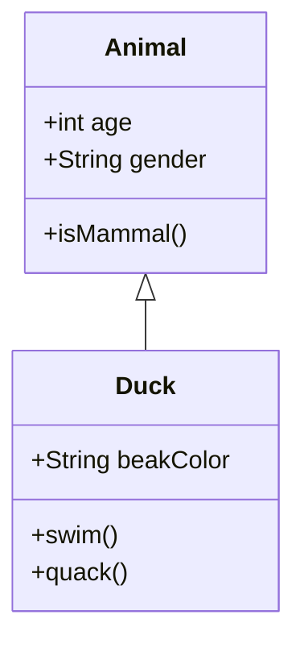
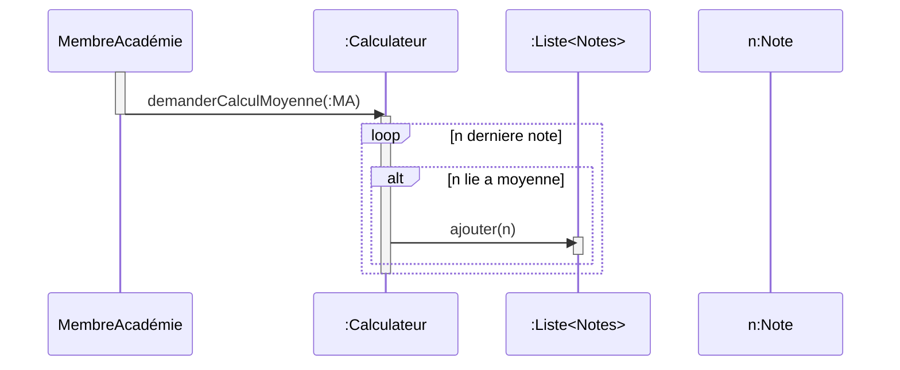
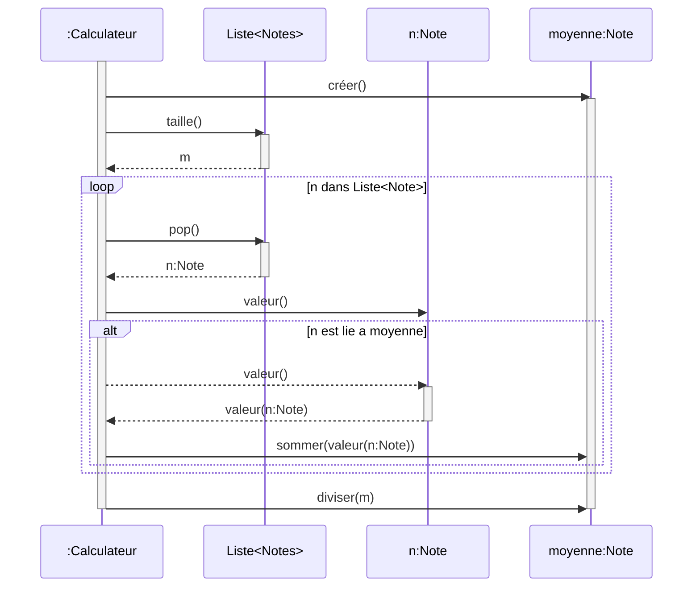

# Cour du 2025/09/23 - UML : Introduction

### 1.0 - Un language de modélisation

Contrairement à un language de programmation, un language de modélisation n'est pas concu pour être exécuté.\
**UML** est une unification de plusieurs languages de modélisation (Unified Models Language).

### 1.1 - Qu'est ce qu'un modèle

**Un modèle représente un sujet d'étude, de manière numérique et abstraite.**

- Définir les différents concepts utilisés de manière non-ambiguë
- Être suffisamment générique pour s'adapter à l'existant
- Être capable d'évoluer facilement pour les futures avancées
- Couvrir les aspects du développement allant de l ’analyse jusqu’au déploiement pour n'utiliser qu'un langage sur tout le processus
- Être indépendant des langages de programmation et décrire formellement les modèles applicables pour lever les ambiguïtés

### 1.2 - UML

**UML est une norme de représentation.**\
Acceptée par l'OMG (Object Management Group) en 1997 comme support de l'approche MDA (Model Driven Architecture).

- Avec l'UML, on va dabord modéliser notre projet, qui permet par la suite de définir l'architecture.

- C'est un support de communication, car il est graphique et donc facilement compréhensible par monsieur tout le monde

- Chaque **type** de diagramme poscède une structure qui véhicule une sémantique précise.

### 1.3 - Diagrammes

**Deux types de diagrammes**

**1. Diagrammes structurels**\
Ils représentent l'aspect statique d'un système.

- Diagramme de classe
  - description statique du système en intégrant dans chaque classe la partie dédiée aux données et celle consacrée aux traitements.
- Diagramme d’objet
  - représente les instances des classes et des liens entre instances.
- Diagramme de composants
  - représente les différents constituants du logiciel
- Diagramme de déploiement
  - décrit l’architecture technique d’un système avec une vue centrée sur la répartition des composants
- Diagramme de paquetage
  - vue d’ensemble du système structuré en paquetage réunissant les classes fortement couplées.
- Diagramme de structure composite
  - décrit la structure interne d’un ensemble complexe

**2. Diagrammes de comportement**\
Ils représentent la partie dynamique d'un système.

- Diagramme des cas d’utilisation
  - besoins des utilisateurs par rapport au système.
- Diagramme d’activités
  - montre les enchaînements des activités propres à une opération ou à un cas d’utilisation.
- Diagramme de séquence
  - scénarios de chaque cas d’utilisation en mettant l’accent sur la chronologie des opérations
- Diagramme d’état-transition (machine d’état)
  - montre les différents états des objets en réaction aux événements.
- Diagramme de temps
  - représente les états et les interactions d’objets dans un contexte où le temps a une forte influence sur le comportement du système à gérer.
- Diagramme de communication
  - représentation des scénarios qui met plus l’accent sur les objets et les messages échangés
- Diagramme global d’interaction
  - fournit une vue générale des interactions décrites dans le diagramme de séquence et des flots de contrôle décrits dans le diagramme d’activités.

Dans ce cour, on va voir les diagrammes de cas **d’utilisation**, **d'activité**, de **classe** et **d'objet**.

### 1.4 Diagramme de cas d'utilisation

Sert à receuillir et décrire les besoins des utilisateurs du système.\
Permet de décrire les intéreactions entre les acteurs, et le système.

1. **Inclusion et extension**\
   Si le cas B inclut le cas A, alors le cas B contient le comportement décrit dans A.

   Si le cas B étend le cas A, alors le cas B peut étendre et personnaliser des comportements décrit dans A

2. **Sénarios Nominaux et alternatifs**\
   Un sénario nominal représente un sénario entre un utilisateur et le système, dans le cas ou tout se passe bien. (cas passant)

   Un sénario alternatif correspond au sénario quand un problème est rencontré dans l'éxecution du cas. (cas non passant)

### 1.5 Diagrammes d'activité

Ils servent à décrire les diférents sénarios nominaux et alternatifs.\
Généralement, un diagramme d'activité a de pair avec un sénario du diagramme des cas d'utilisation.

### 1.6 Diagrammes de séquence

- Il représente les intéractions entre les objets (système ou humains) avec la chronologie des échanges.
- Chaque objet à une ligne de vie.
- Il est utilisé pour décrire une ou plusieurs activités et permet d'identifier les objets nécessaires à leur réalisation.
- Chaque objet à une ligne de vie. Elle permet de déterminer les périodes d'activité et d'inactivité de l'objet dans le système.

### 1.7 Diagramme de class et d'objet

- Les diagrammes de **_Classes_** donnent une représentation statique du système à développer.
- Ils décrivent les classes et leurs relations dans le système.
- Une classe décrit les données et traitement qu'une entitée entretien en son sein, ainsi que ses relations avec les autres entitées du système.
- Les objets sont des instances de classes

les diagrammes de classes et d'objets s'écrivent simultanément car ils sont intimement liées voir indissociables.

# 2025/10/01 : Second cour

### Methodologie pour chaque diagrammes :

| Diagramme         | Rôle dans la conception                                                                                                                                                                                                                                                     | Bonnes pratiques                                                                                                                                                  |
| ----------------- | --------------------------------------------------------------------------------------------------------------------------------------------------------------------------------------------------------------------------------------------------------------------------- | ----------------------------------------------------------------------------------------------------------------------------------------------------------------- |
| Cas d'utilisation | Définition du système cible. Identification des acteurs et de leur relation au système via des cas d'utilisation. Description textuelle des cas                                                                                                                             | Faire évoluer le diagramme par itérations. Justifier par le cahier des charges ou des hypotheses du domaine les éléments présents sur les diagrammes.             |
| Activité          | Formalise les sénarios d'exécution d'un cas d'utilisation. Identifie et définit les activités et transitions. Met en évidence les objets requis, construits et détruits et l'enchainement des activités.                                                                    | Partir du sénario nominal. Limiter la portée des activités.                                                                                                       |
| Séquence          | Décrit les activités au travers des messages échangés entre les objets du système. Confirme l'usage des objets dans l'enchainement des activités. Identifie et définit les membres des classes d'appartenance des objets nécéssaires au déroulement des activités décrites. | Ne pas hésiter à créer des objets si ils sont nécéssaires pour faire l'interface avec les acteurs humains. Limiter les imbrications de boucles et d'alternatives. |
| Objet & Classe    | Représente l'état de la mémoire du système à un instant donné (objet) ou de manière généralisé (classe). Définit les liens entre objets et les généralisent en associations de classe. S'appuient sur les membres décrits dans les séquences.                               | Utiliser un language sans ambiguité dans la définition des méthodes, atributs et associations.                                                                    |

### Définitions :

- **Message Synchrone :** Attend une réponse, c'est un échange synchronisé
- **Message asynchrone :** N'attend pas de réponse. N'est pas synchronisé

### Exercice du calcul de moyenne

On constate que l'on travaille avec des Acteurs, et des Notes.  
Les acteurs peuvent être de différent type.  
Les notes sont reliées à différents acteurs.

**Constat :**  
Pour calculer des moyennes, il nous faudrait un objet d'interface entre les acteurs et leurs notes : Calculateur.

Avec ce constat, on à assez d'outils pour entamer un diagramme de séquence :

Ce diagramme montre la demande d'un acteur au calculateur de calculer une moyenne.  
Le calculateur va boucler sur toutes les notes du système et sélectionner celles liées à la demande de l'acteur.  
Ce diagramme n'est pas complet mais permet de définir une base générique pour les fonctionnements spécifiques pour chaque acteurs.

---

On peut définir un diagramme plus précis de la méthode de calcul du Calculateur, toujours générique :

