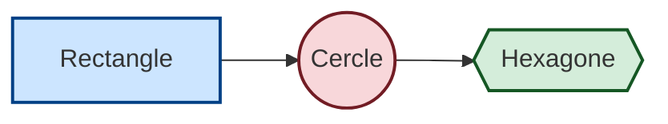
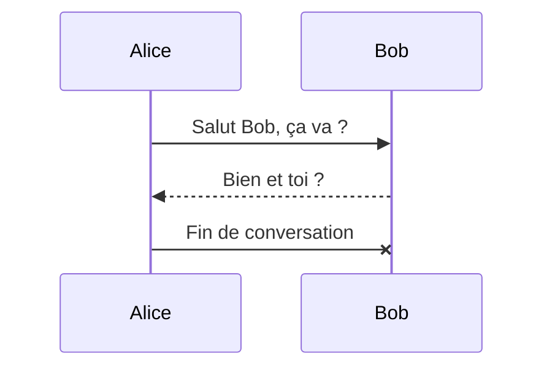
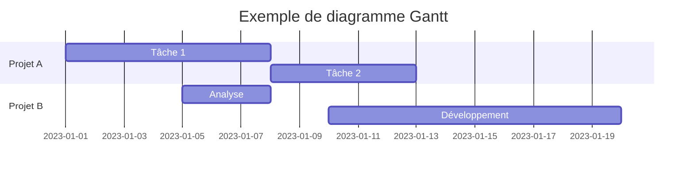
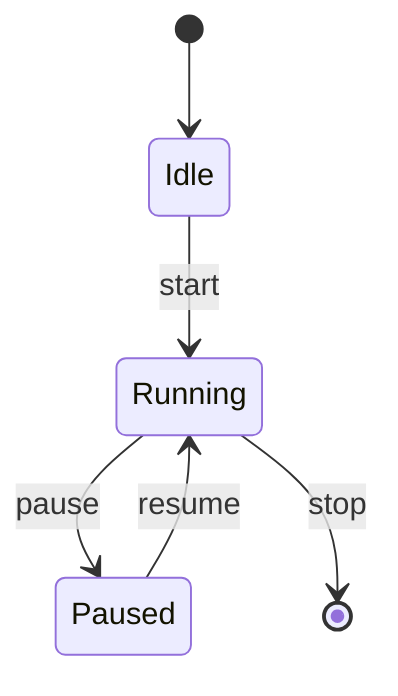
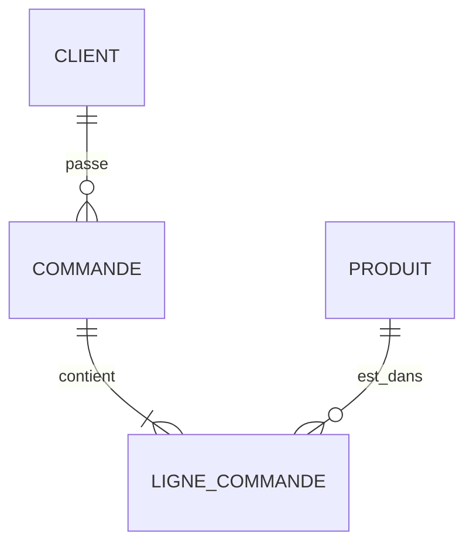
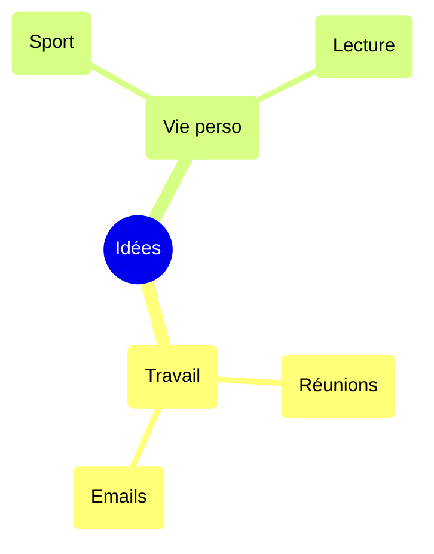
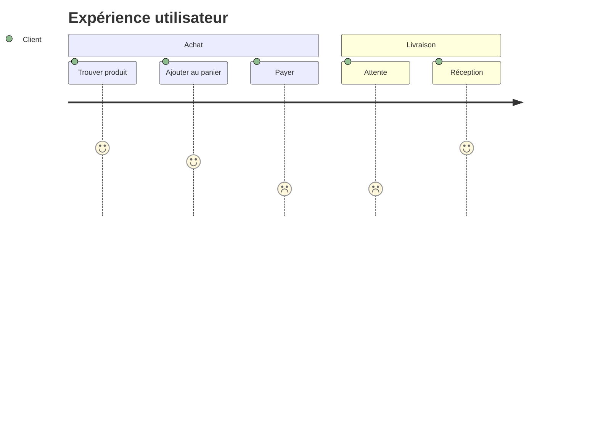
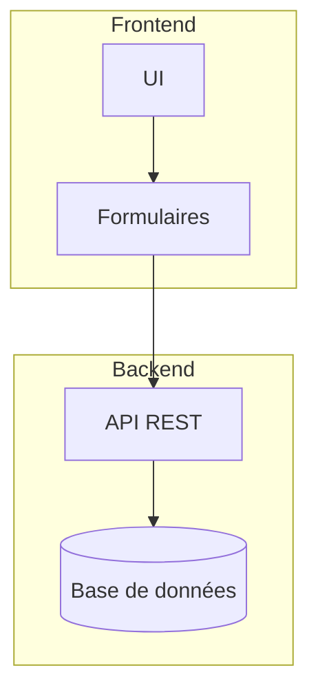
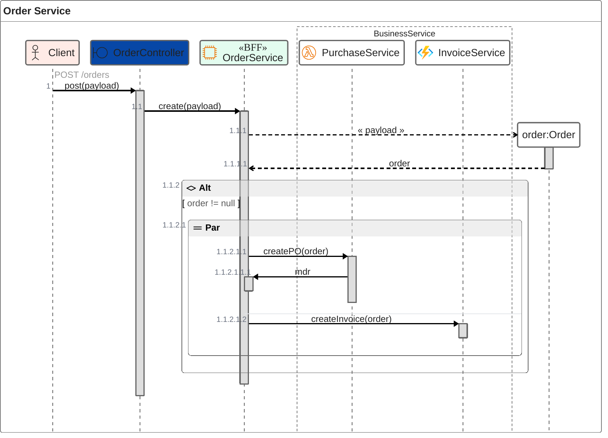

# Changement de couleur et de forme

# Diagramme de séquence

# Diagramme de Gantt

# Diagramme d'état

# Diagramme d'ER

# Roadmap

# Diagramme Journey (User Routes)

# Sous-graphes

# Zen-UML

